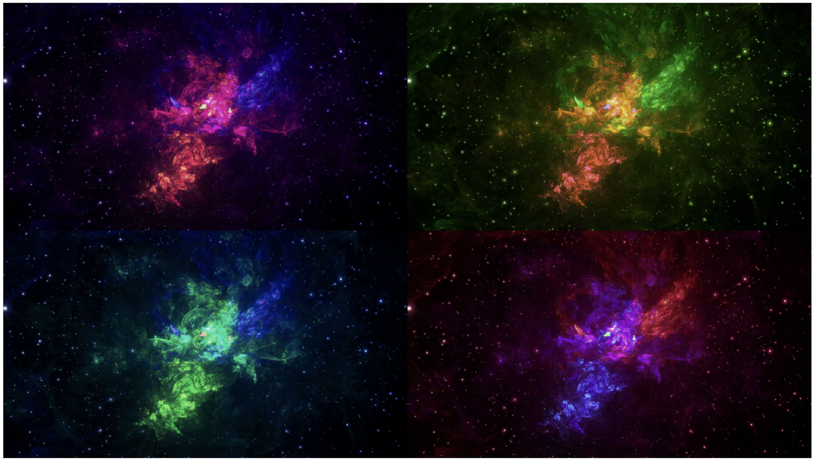

# computer-vision homework 1

Prepare env with conda
1. Install conda or miniconda
2. Execute commnads:

    `conda env create -f env-file.yml`

    `conda activate hw1`
    
    `python -m ipykernel install --user --name hw1 --display-name "Python 3.8 (hw1)" `

3. Run: `jupyter notebook`

Collage results:

Img1:

Img2:

Img3:

