# computer-vision homework 11

To work with tensorflow on Apple processors Silicon file for installing dependencies via conda [label](env-file.yml)

Start results

Train MAE      23658.843338489532

Validation MAE 25390.008091926575

+softmax

Train MAE      22544.610500335693

Validation MAE 24360.00108718872

Try different models:

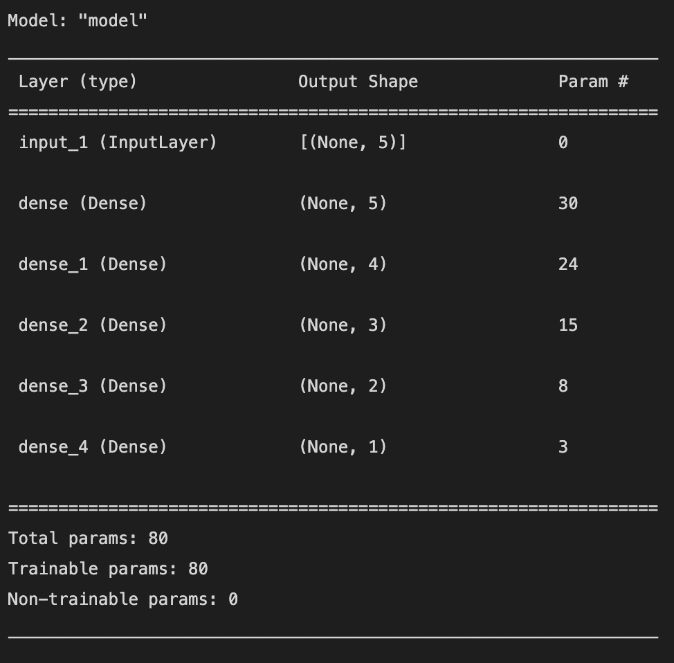

Train MAE      21975.7080078125

Validation MAE 24358.67190361023

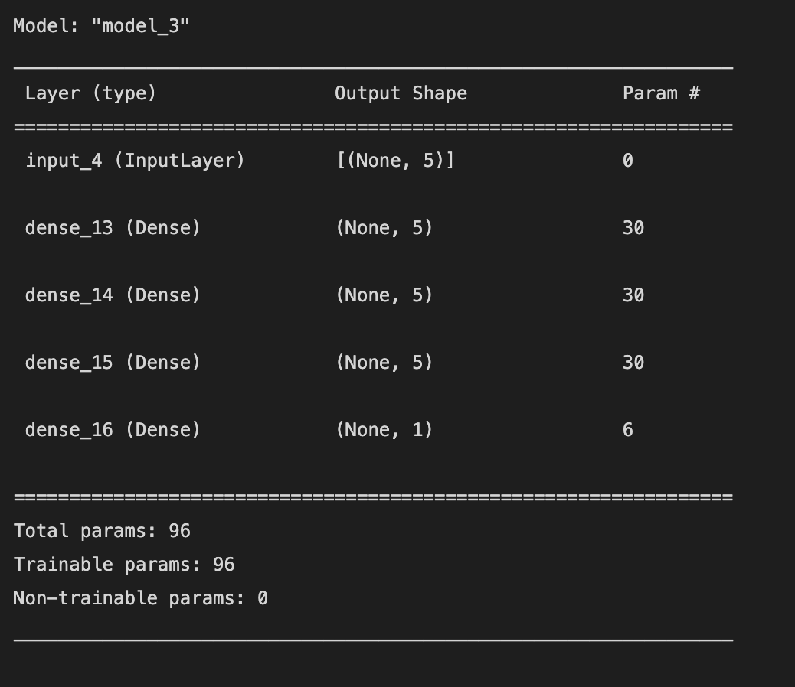

Train MAE      22189.266979694366

Validation MAE 23932.671546936035

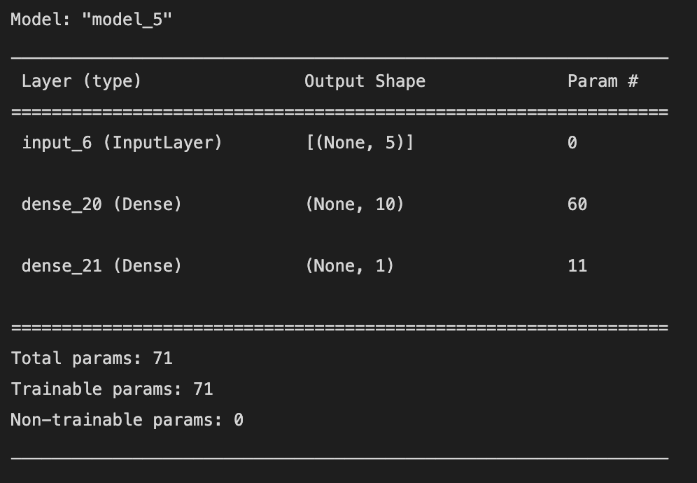

Train MAE      22170.2978014946

Validation MAE 24320.30290365219

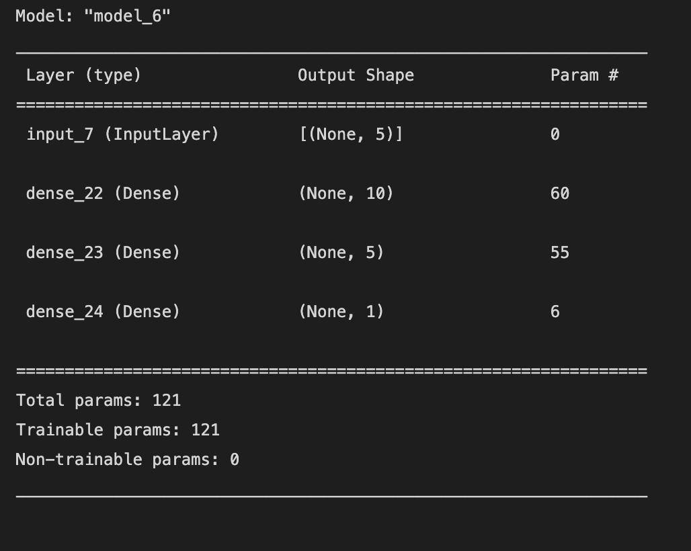

Train MAE      21601.764857769012

Validation MAE 24057.431519031525

Add new param LotArea

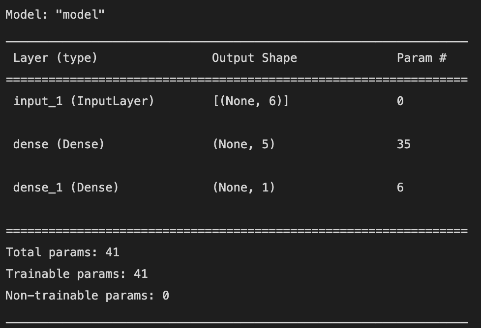

Train MAE      22295.97270488739

Validation MAE 24133.381247520447

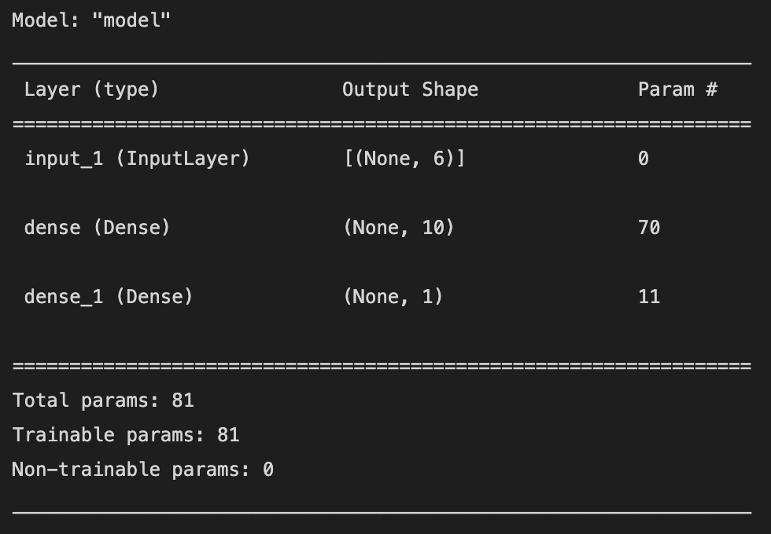

Train MAE      21310.028433799744

Validation MAE 24417.614936828613

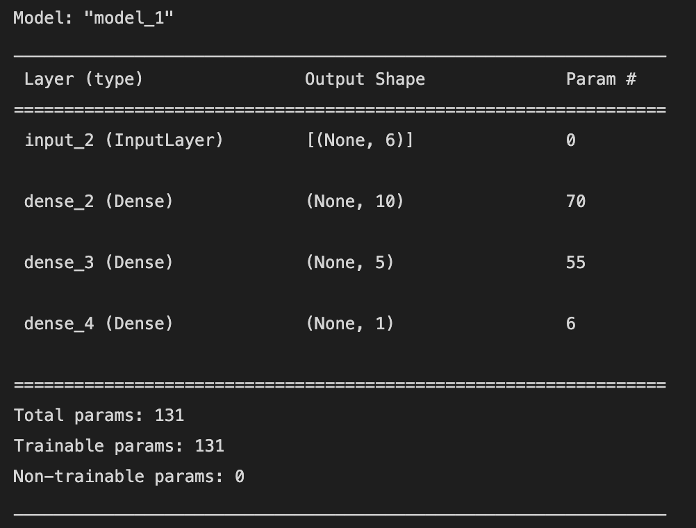

Train MAE      20816.60032272339

Validation MAE 23788.298666477203

Add 'LotFrontage','OverallQual','OverallCond','YearBuilt','YearRemodAdd', 'GrLivArea', 'GarageArea'

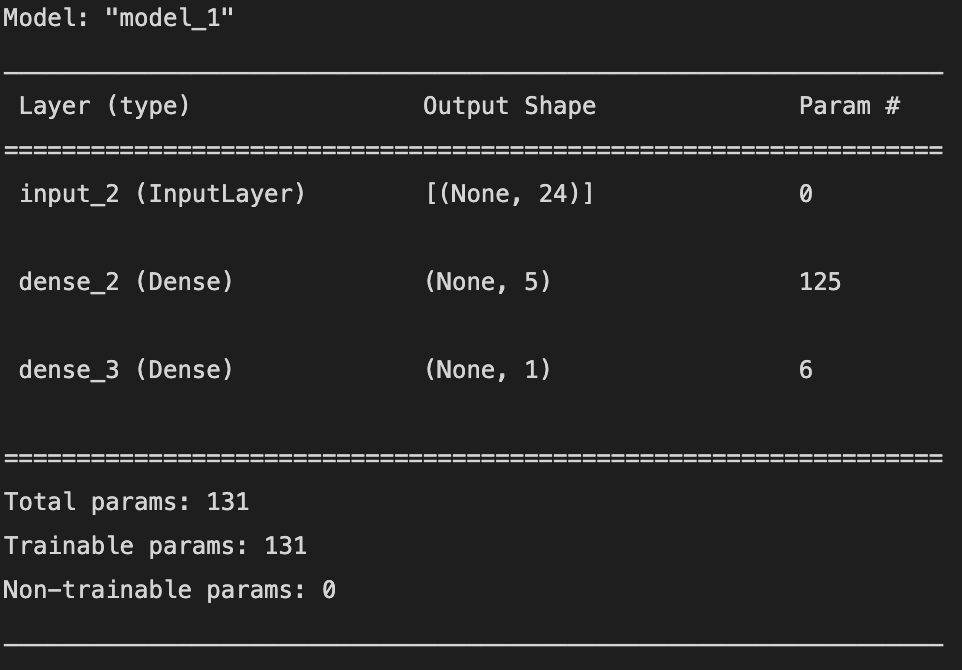

Train MAE      19682.25985765457

Validation MAE 21773.619949817657

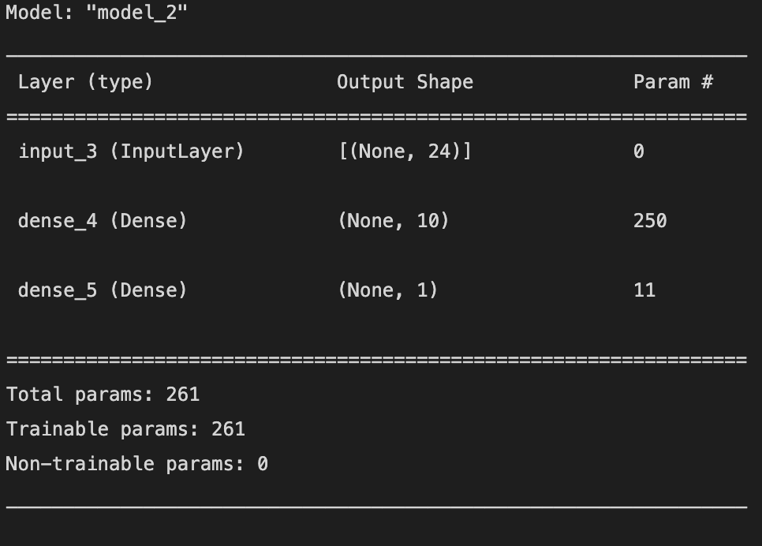

Train MAE      18956.580758094788

Validation MAE 22531.78060054779

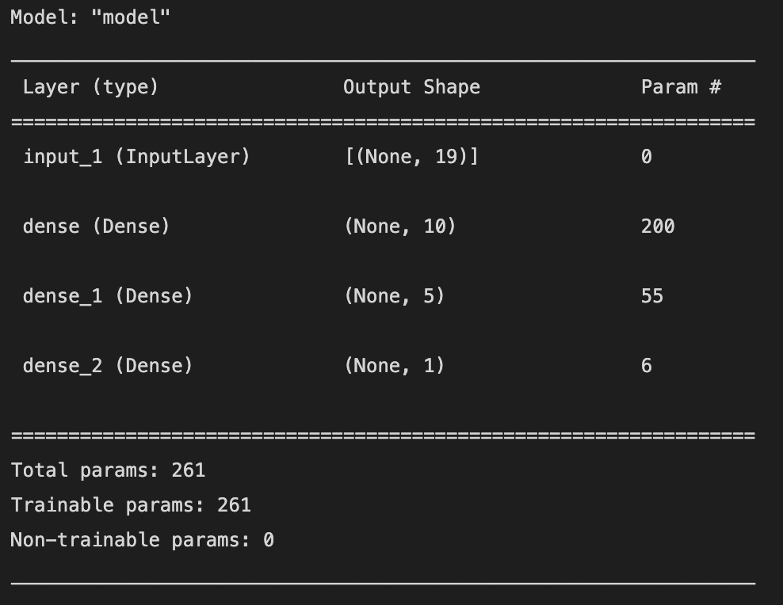

Train MAE      19638.316333293915

Validation MAE 22410.82191467285

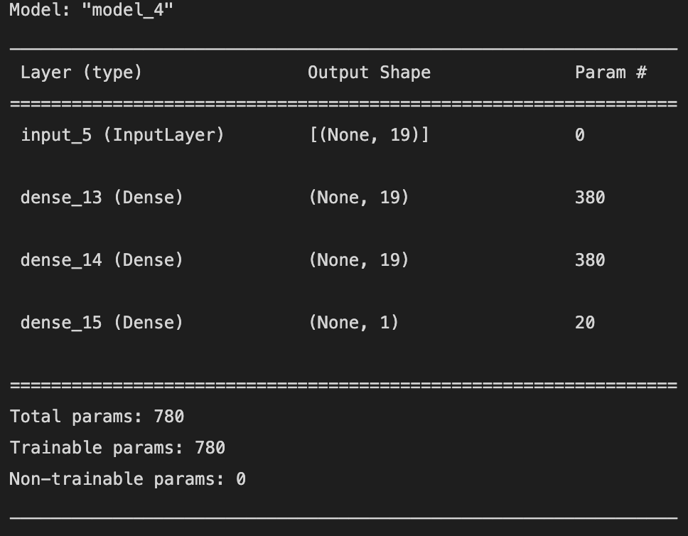

Train MAE      16309.159994125366

Validation MAE 21023.87547492981

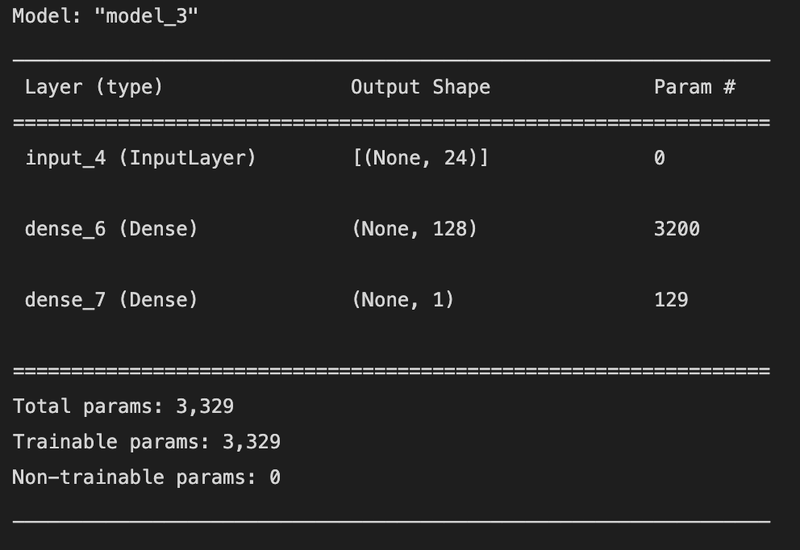

Train MAE      11783.53801369667

Validation MAE 22299.286723136902