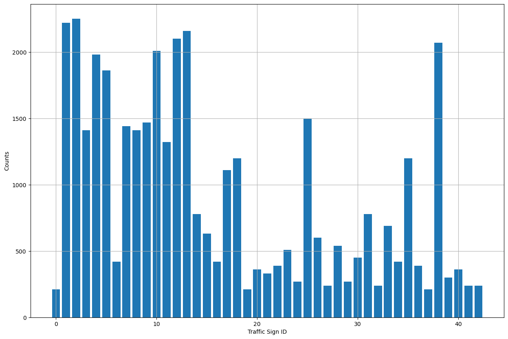
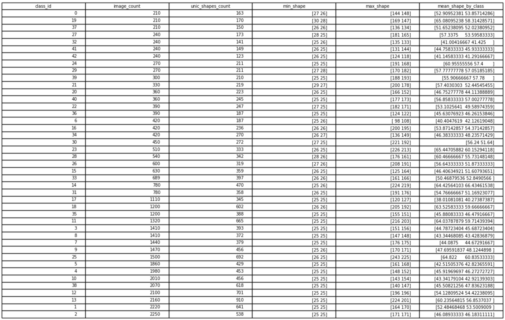
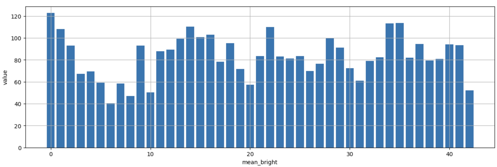
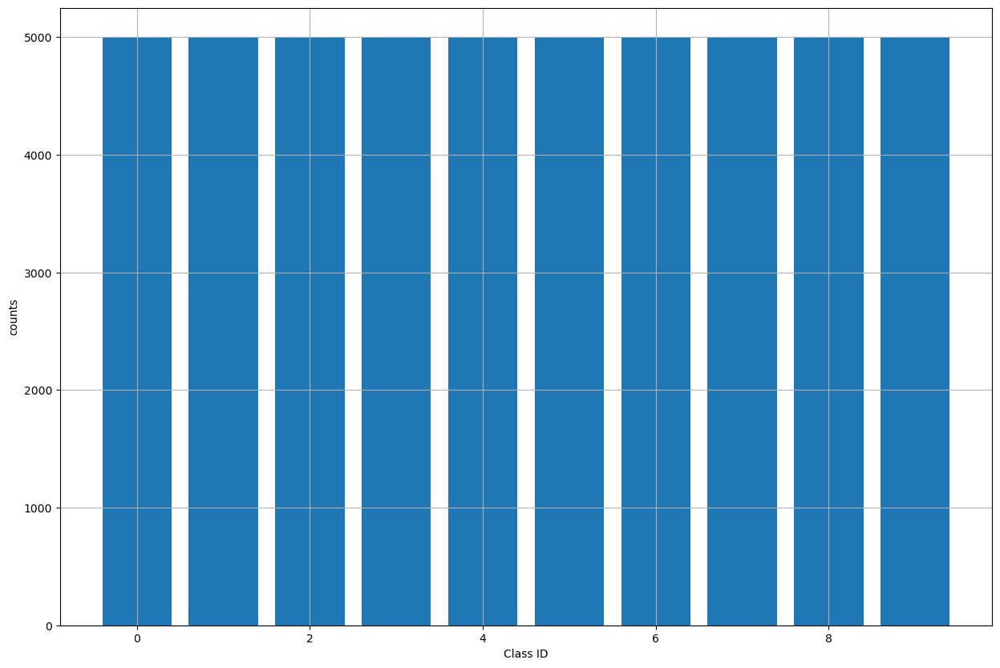
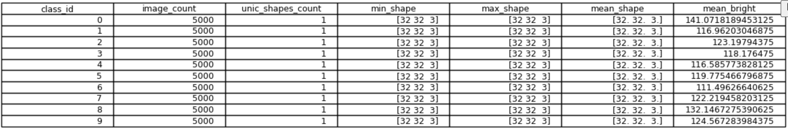
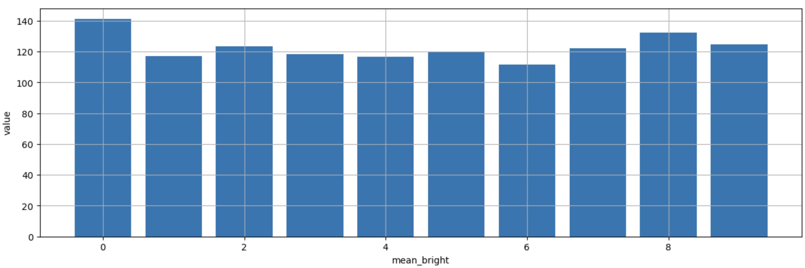

# computer-vision homework 12

Analysis result GTSRB:

Number of images in classes:

Number of unique image sizes, minimum, maximum and average image size:

Distribution of mean brightness by classes

Analysis result CIFAR10:

Number of images in classes:

Number of unique image sizes, minimum, maximum and average image size:

Distribution of mean brightness by classes
