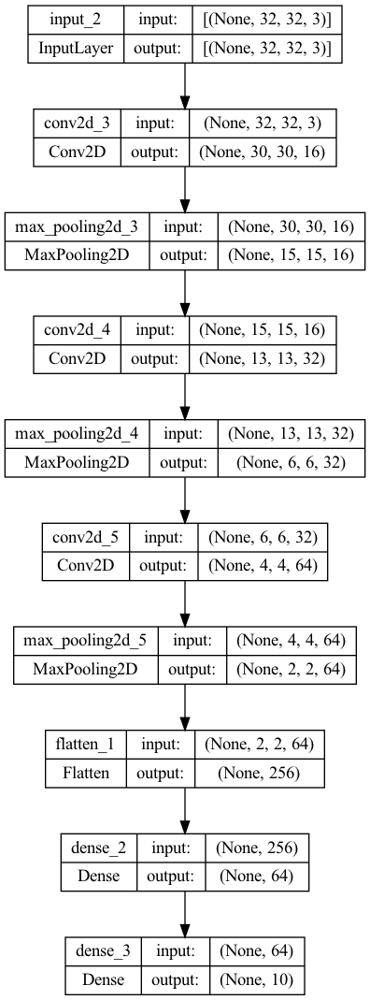
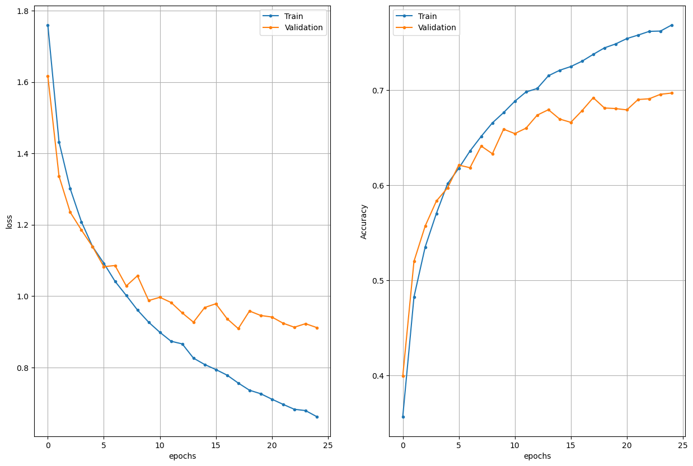
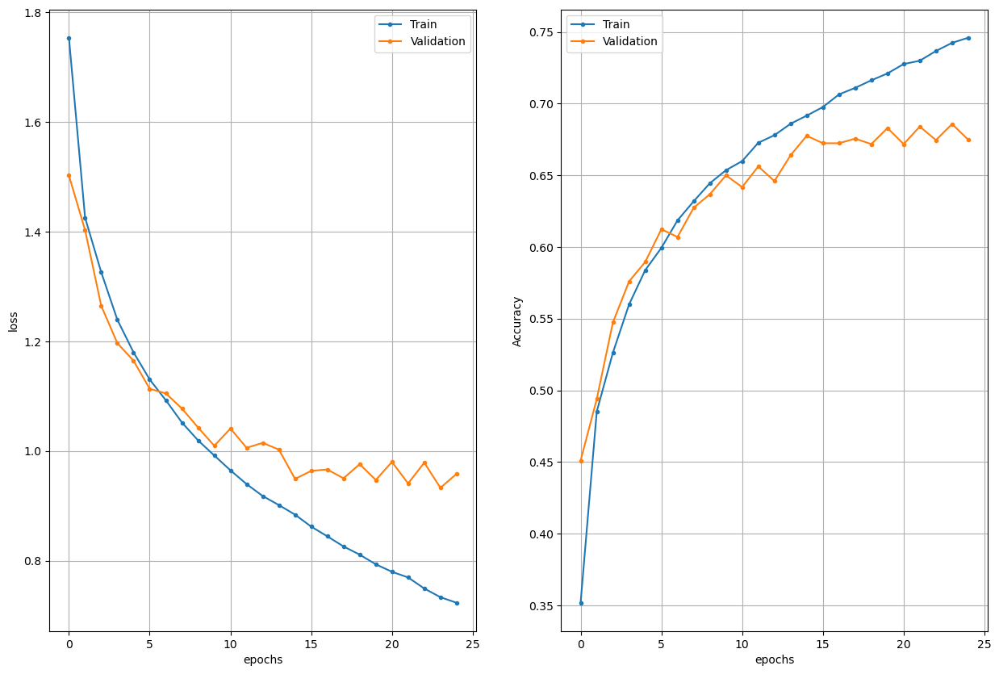
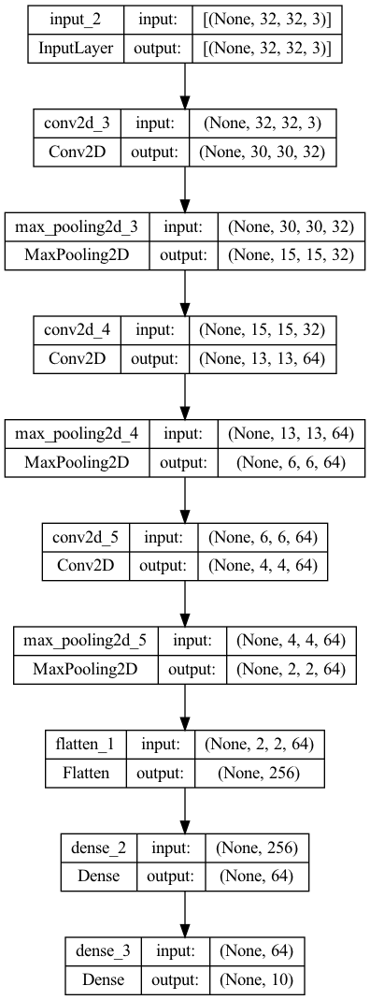
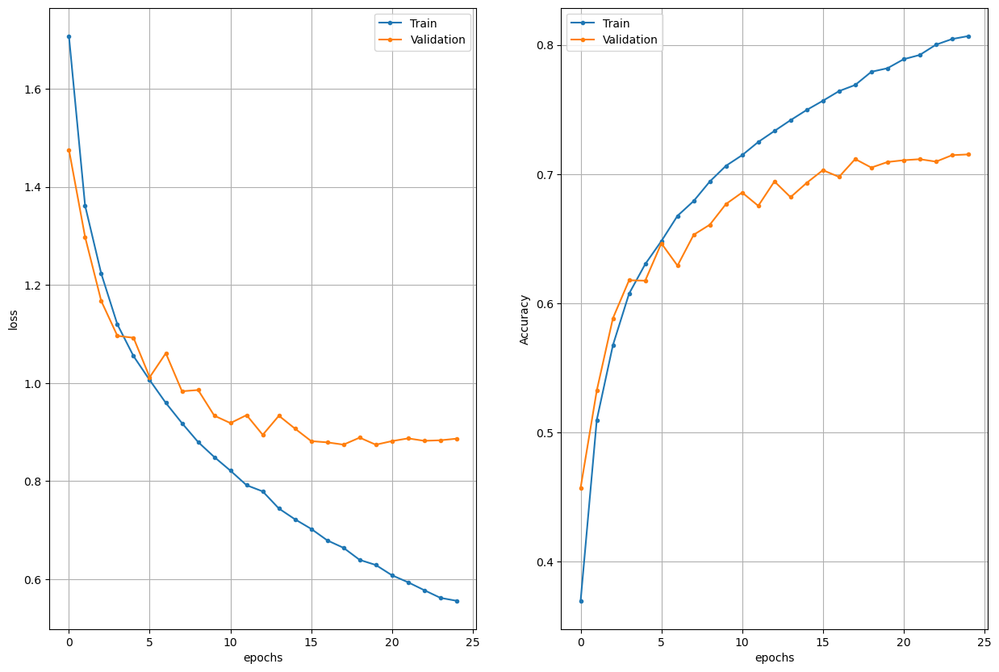
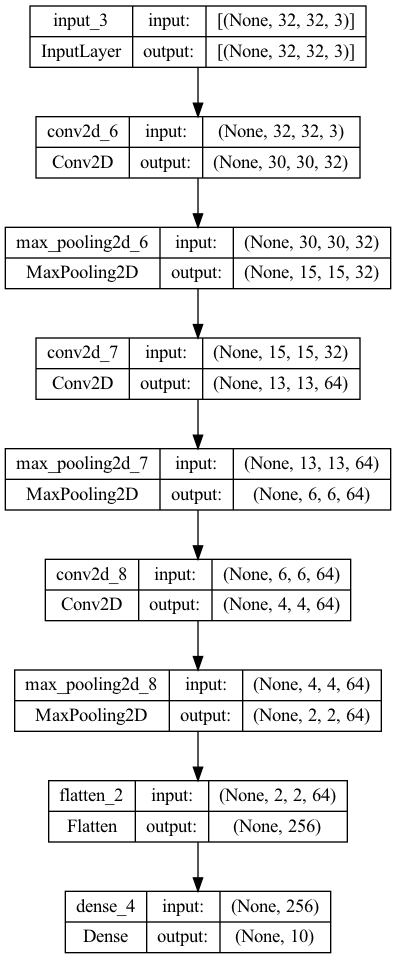
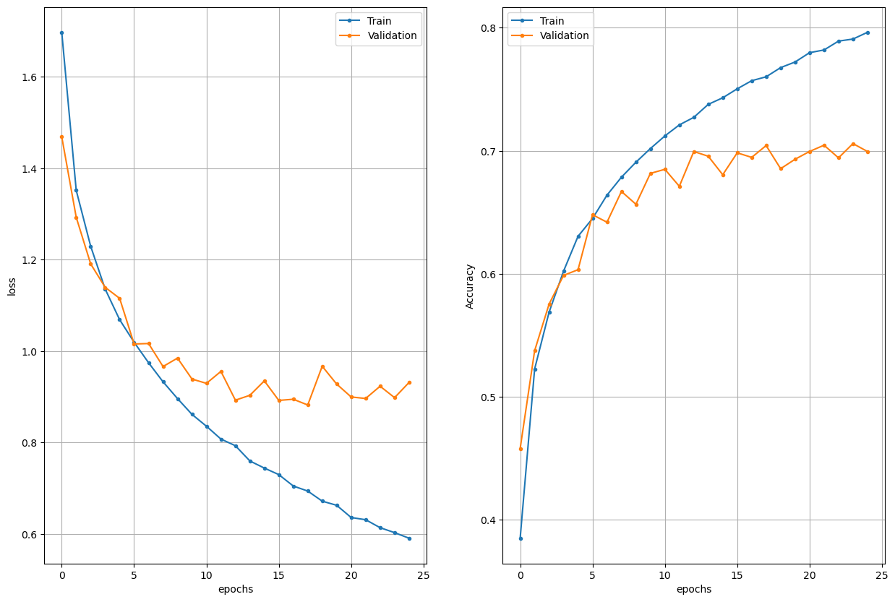
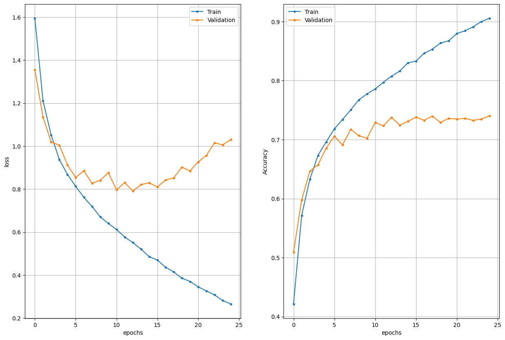
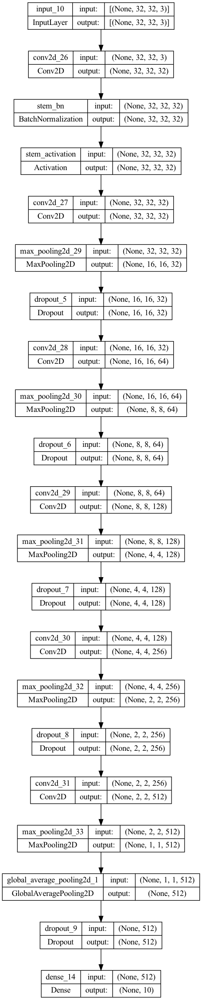
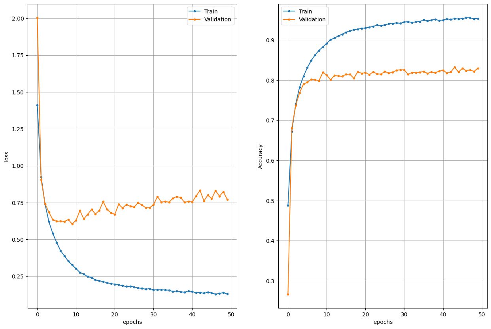

# computer-vision homework 13

## Model architecture:

### Fit with validation data epochs = 25 batch_size = 128

Training history:

Accuracy for each class:

* plane 0.659
* car 0.807
* bird 0.552
* cat 0.483
* deer 0.723
* dog 0.643
* frog 0.822
* horse 0.677
* ship 0.796
* truck 0.807

Test loss   0.9118080735206604

Test metric 0.6969000101089478

### Fit with validation split = 0.1 epochs = 25 batch_size = 128

Training history:

* plane 0.822
* car 0.84
* bird 0.622
* cat 0.525
* deer 0.53
* dog 0.639
* frog 0.674
* horse 0.701
* ship 0.649
* truck 0.681

Test loss   0.9769315719604492

Test metric 0.6683000326156616

## Model architecture:

### Fit with validation data epochs = 25 batch_size = 128

Training history:

Accuracy for each class:

* plane 0.789
* car 0.854
* bird 0.658
* cat 0.501
* deer 0.67
* dog 0.635
* frog 0.799
* horse 0.674
* ship 0.799
* truck 0.773

Test loss   0.886644184589386

Test metric 0.7152000069618225

## Model architecture:

### Fit with validation data epochs = 25 batch_size = 128

Training history:

Accuracy for each class:

* plane 0.733
* car 0.808
* bird 0.488
* cat 0.552
* deer 0.769
* dog 0.661
* frog 0.786
* horse 0.663
* ship 0.785
* truck 0.75

Test loss   0.9315229654312134

Test metric 0.6995000243186951

## Model architecture (add padding = same):

### Fit with validation data epochs = 25 batch_size = 128

Training history:

Accuracy for each class:

* plane 0.801
* car 0.822
* bird 0.631
* cat 0.531
* deer 0.745
* dog 0.625
* frog 0.829
* horse 0.754
* ship 0.825
* truck 0.838

Test loss   1.0302772521972656

Test metric 0.7401000261306763

## Model architecture (architecture found in internet):

Training history:

Accuracy for each class:

* plane 0.822
* car 0.896
* bird 0.755
* cat 0.703
* deer 0.783
* dog 0.768
* frog 0.887
* horse 0.862
* ship 0.922
* truck 0.899

Test loss   0.7727797031402588
Test metric 0.8297000527381897