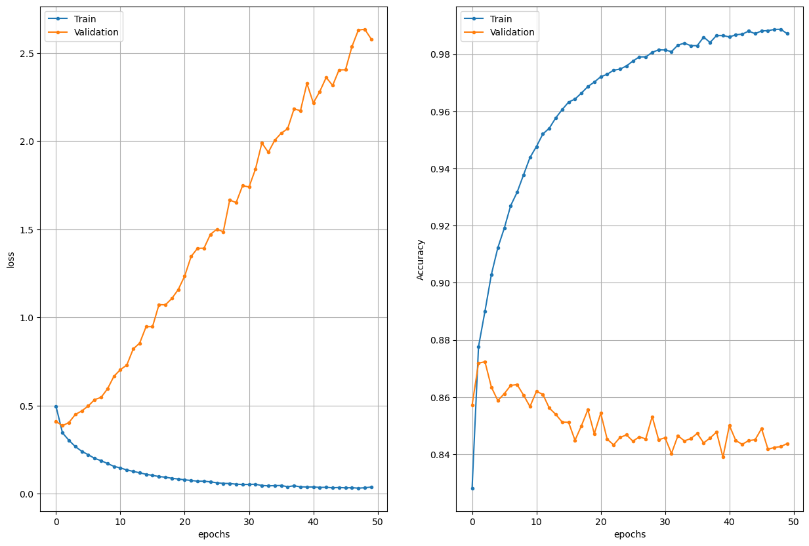
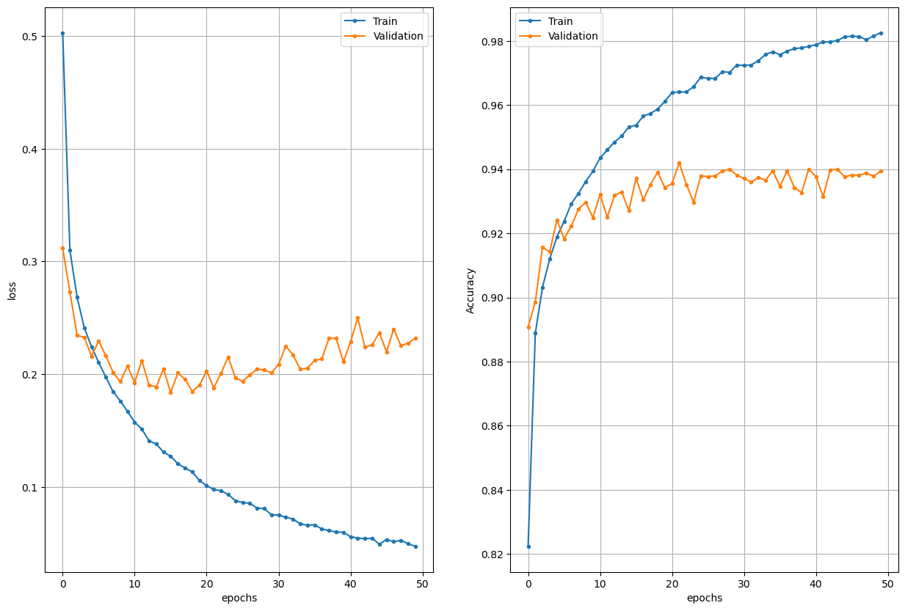
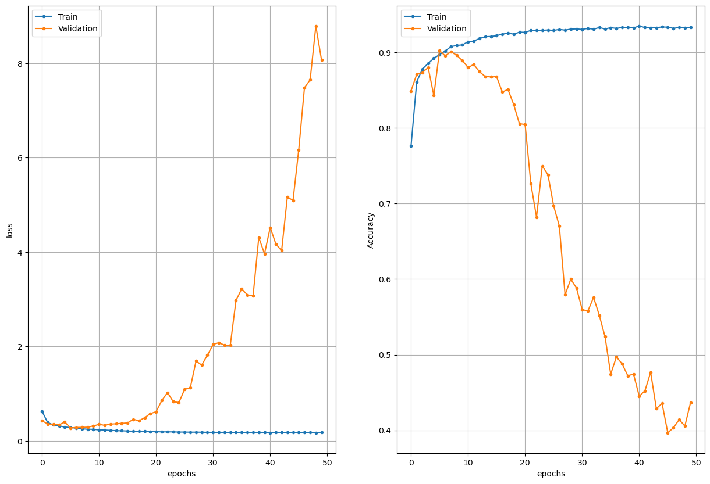

# computer-vision homework 13

## Starting model
_________________________________________________________________
 Layer (type)                Output Shape              Param #   
=================================================================
 input_1 (InputLayer)        [(None, 28, 28, 1)]       0         
                                                                 
 conv2d (Conv2D)             (None, 28, 28, 32)        320       
                                                                 
 flatten (Flatten)           (None, 25088)             0         
                                                                 
 dense (Dense)               (None, 128)               3211392   
                                                                 
 dense_1 (Dense)             (None, 10)                1290      
                                                                 
=================================================================
Total params: 3,213,002

Trainable params: 3,213,002

Non-trainable params: 0
_________________________________________________________________

## Training results 

Train Acc      0.9332810640335083

Validation Acc 0.4369000196456909

* 0 0.747
* 1 0.964
* 2 0.782
* 3 0.839
* 4 0.699
* 5 0.932
* 6 0.644
* 7 0.942
* 8 0.941
* 9 0.948

## Improved model

_________________________________________________________________
 Layer (type)                Output Shape              Param #   
=================================================================
 input_9 (InputLayer)        [(None, 28, 28, 1)]       0         
                                                                 
 conv2d_27 (Conv2D)          (None, 28, 28, 32)        320       
                                                                 
 batch_normalization_25 (Bat  (None, 28, 28, 32)       128       
 chNormalization)                                                
                                                                 
 conv2d_28 (Conv2D)          (None, 28, 28, 32)        9248      
                                                                 
 batch_normalization_26 (Bat  (None, 28, 28, 32)       128       
 chNormalization)                                                
                                                                 
 max_pooling2d_12 (MaxPoolin  (None, 14, 14, 32)       0         
 g2D)                                                            
                                                                 
 dropout_17 (Dropout)        (None, 14, 14, 32)        0         
                                                                 
 conv2d_29 (Conv2D)          (None, 14, 14, 64)        18496     
                                                                 
 batch_normalization_27 (Bat  (None, 14, 14, 64)       256       
 chNormalization)                                                
                                                                 
 conv2d_30 (Conv2D)          (None, 14, 14, 64)        36928     
                                                                 
 batch_normalization_28 (Bat  (None, 14, 14, 64)       256       
 chNormalization)                                                
                                                                 
 max_pooling2d_13 (MaxPoolin  (None, 7, 7, 64)         0         
 g2D)                                                            
                                                                 
 dropout_18 (Dropout)        (None, 7, 7, 64)          0         
                                                                 
 conv2d_31 (Conv2D)          (None, 7, 7, 128)         73856     
                                                                 
 batch_normalization_29 (Bat  (None, 7, 7, 128)        512       
 chNormalization)                                                
                                                                 
 conv2d_32 (Conv2D)          (None, 7, 7, 128)         147584    
                                                                 
 batch_normalization_30 (Bat  (None, 7, 7, 128)        512       
 chNormalization)                                                
                                                                 
 max_pooling2d_14 (MaxPoolin  (None, 3, 3, 128)        0         
 g2D)                                                            
                                                                 
 dropout_19 (Dropout)        (None, 3, 3, 128)         0         
                                                                 
 flatten_8 (Flatten)         (None, 1152)              0         
                                                                 
 dense_16 (Dense)            (None, 128)               147584    
                                                                 
 batch_normalization_31 (Bat  (None, 128)              512       
 chNormalization)                                                
                                                                 
 dropout_20 (Dropout)        (None, 128)               0         
                                                                 
 dense_17 (Dense)            (None, 10)                1290      
                                                                 
=================================================================
Total params: 437,610

Trainable params: 436,458

Non-trainable params: 1,152
_________________________________________________________________

## Training results 

Train Acc      0.980983316898346

Validation Acc 0.9401000738143921

* 0 0.904
* 1 0.987
* 2 0.926
* 3 0.95
* 4 0.915
* 5 0.983
* 6 0.797
* 7 0.984
* 8 0.99
* 9 0.965

## Training results with gaus blurring

