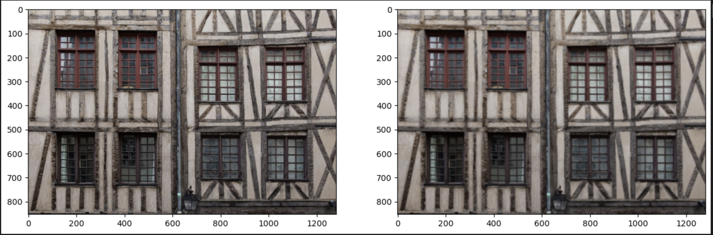
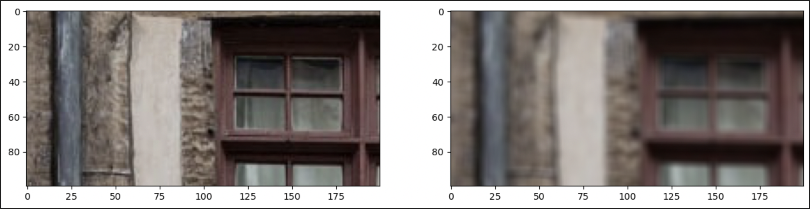
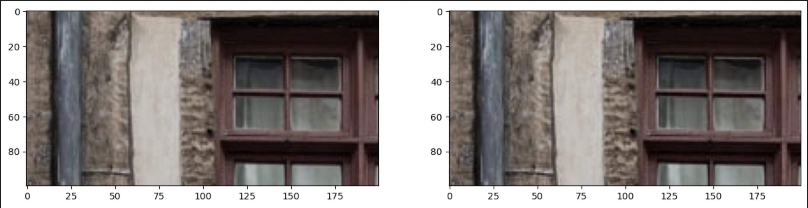
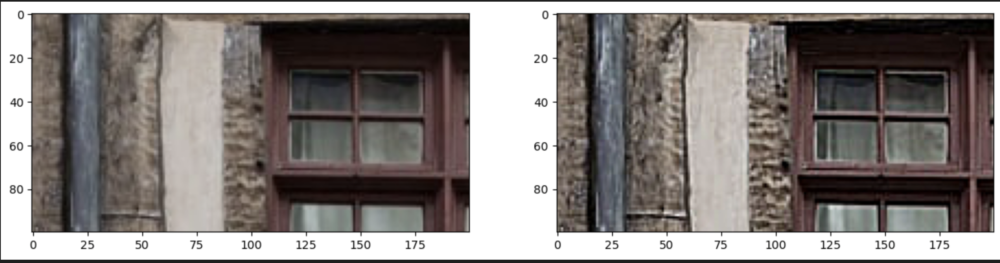
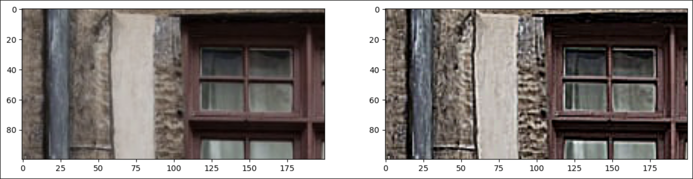
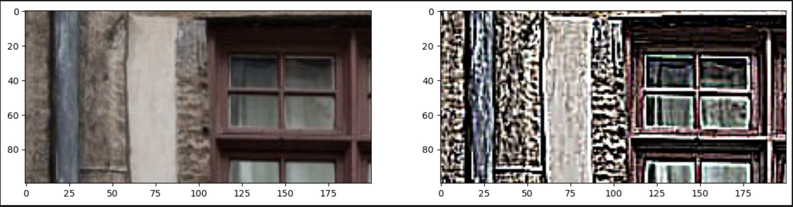

# computer-vision homework 3

Results:

Original and unshraped image:

Difference image (original − unsharp):

Sharpened:
1. amount = -1

    

2. amount = 0.1

    

3. amount = 1

    

4. amount = 1.5

    

5. amount = 9

    
