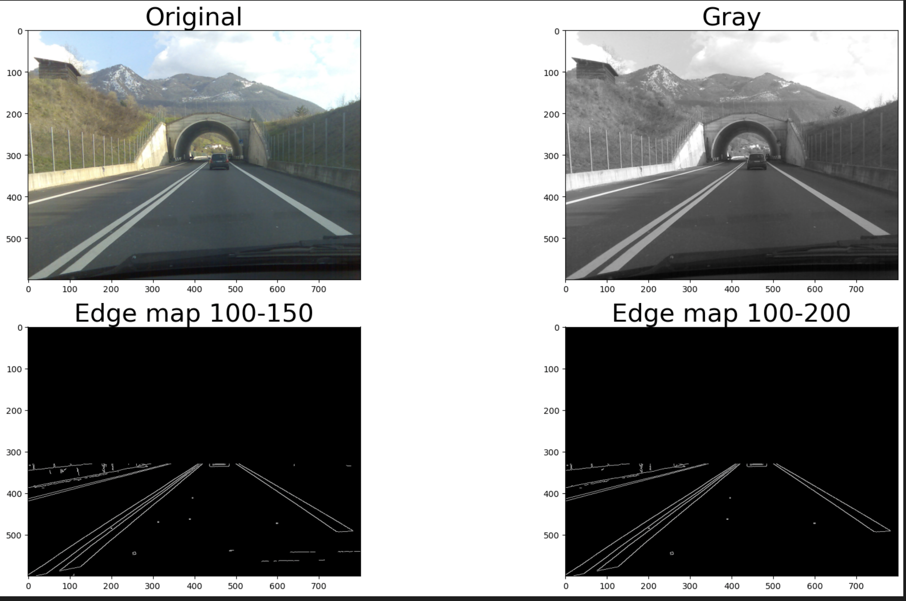

# computer-vision homework 4

Prepare env with conda
1. Install conda or miniconda
2. Execute commnads:

    `conda env create -f env-file.yml`

    `conda activate hw4`
    
    `python -m ipykernel install --user --name hw1 --display-name "Python 3.8 (hw4)" `

3. Run: `jupyter notebook`

Results:

Original image, grayscale, edge map with th_low = 100, th_high = 150, edge map with th_low = 100, th_high = 200

Hough lines all and filtered lines that are approximately horizontal

Final result after k-means clustering

