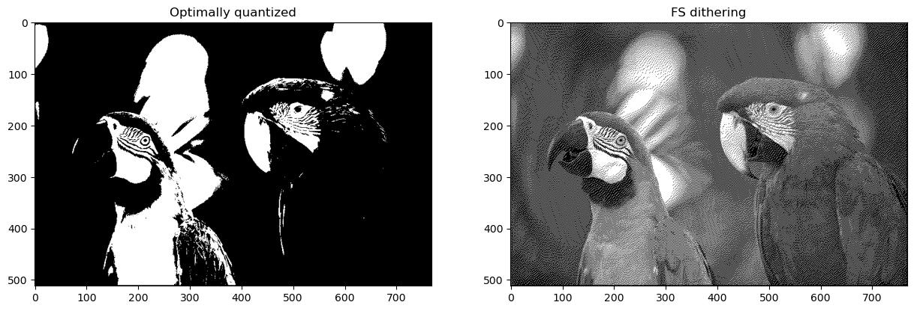

# computer-vision homework 5

Results:

1. Quantized image and FS dithering image for palett from HW (Black, dark gray, light gray, white)

    MSE for image after quantization: 98.57753584120009

    MSE for image after fs-dithering: 99.30795542399089

    PSNR for image after quantization: 28.193024030437762

    PSNR for image after fs-dithering: 28.160963202441383
    
    

2. Quantized image and FS dithering image for palett from HW (Black, white)

    MSE for image after quantization: 108.76808251274957
    
    MSE for image after fs-dithering: 108.60928938123915
    
    PSNR for image after quantization: 27.76578888503906
    
    PSNR for image after fs-dithering: 27.77213388704594

    

    Magnified image (dithering from 1-st palett (4 collor) and 2-d palett (2 color)):

    

3. Quantization with k-means results:

    

4. Floyd-Steinberg Dithering with k-means results:

    