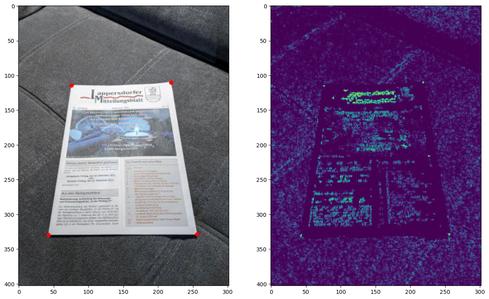
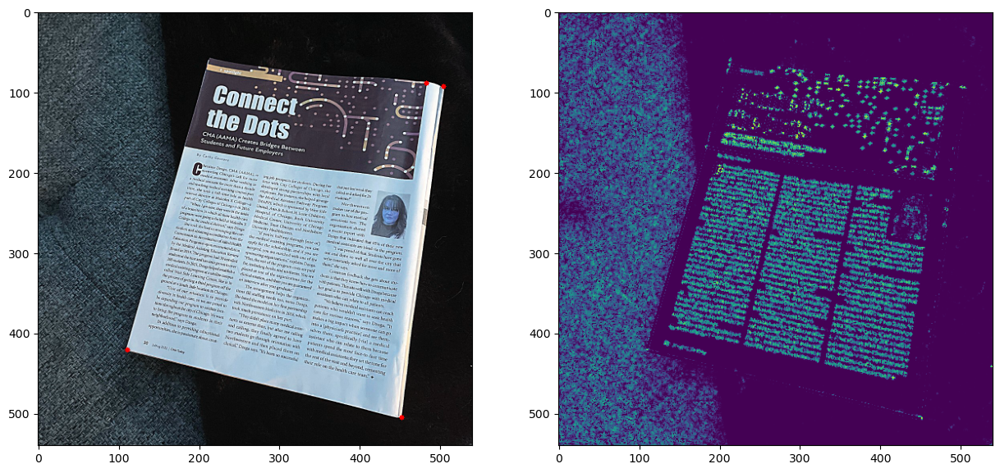

# computer-vision homework 6

Results:

1. Image with the detected document corners
    
    

2. Test on image with high resolution 

    Changes in algorithm:
    
        * Resize image (fx=0.5, fy=0.5)
        * Update quad_size from 7 to 14 
        * TODO to detect top left corner need update descriptor calc for this image

    