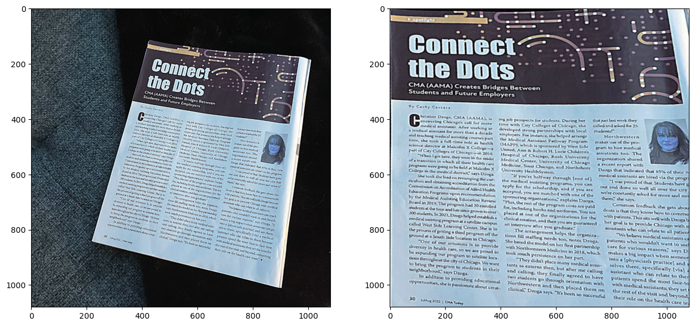
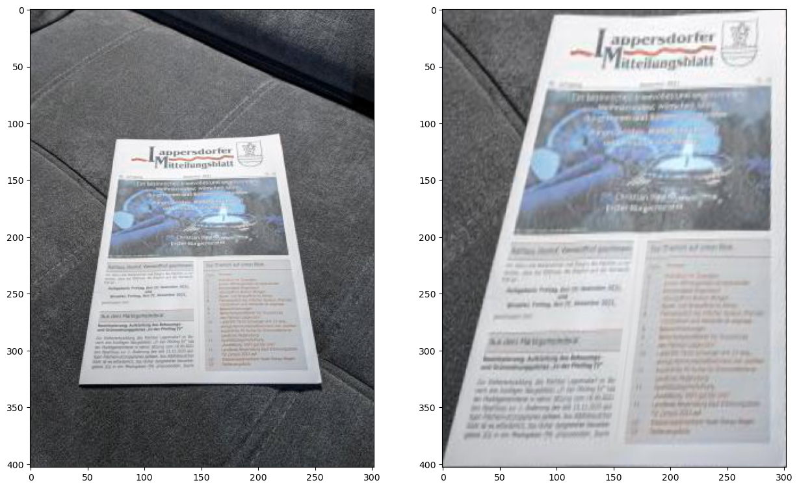
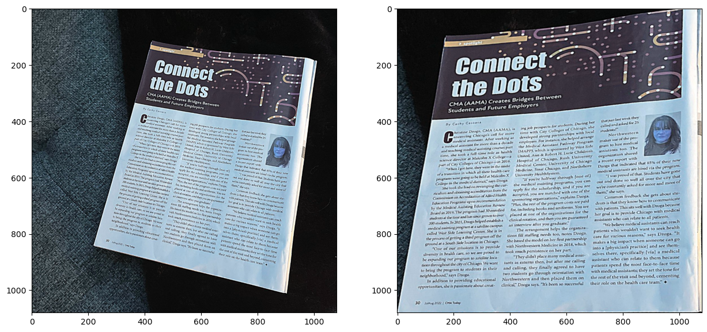
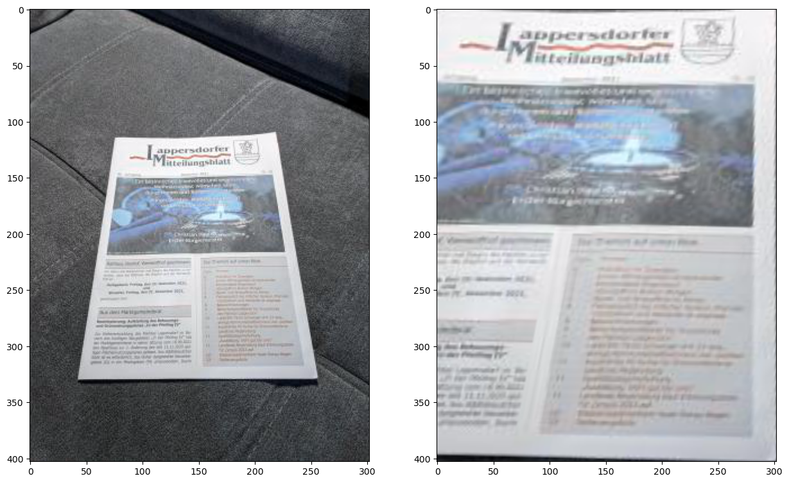
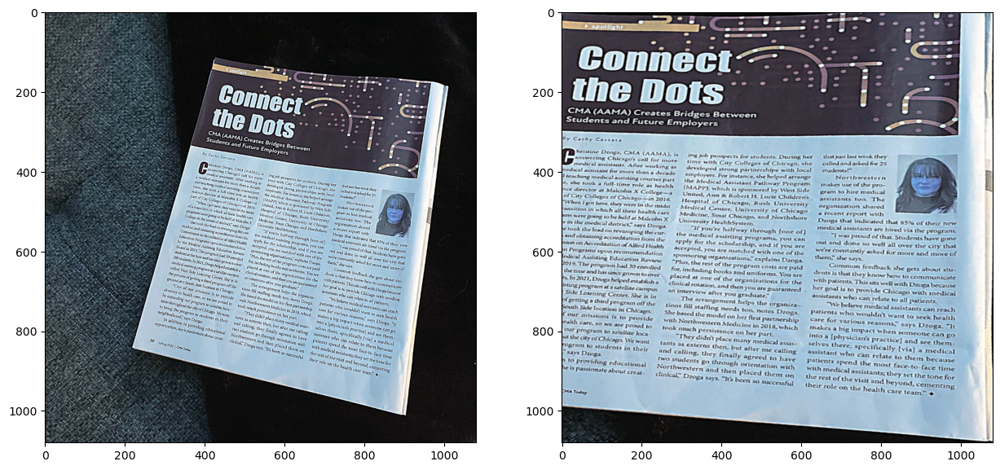
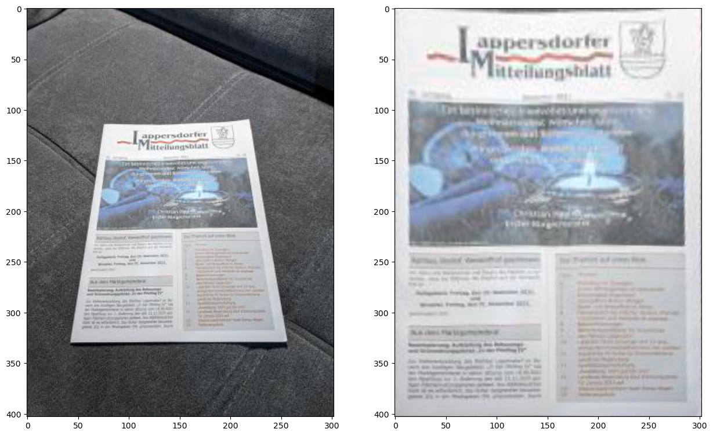
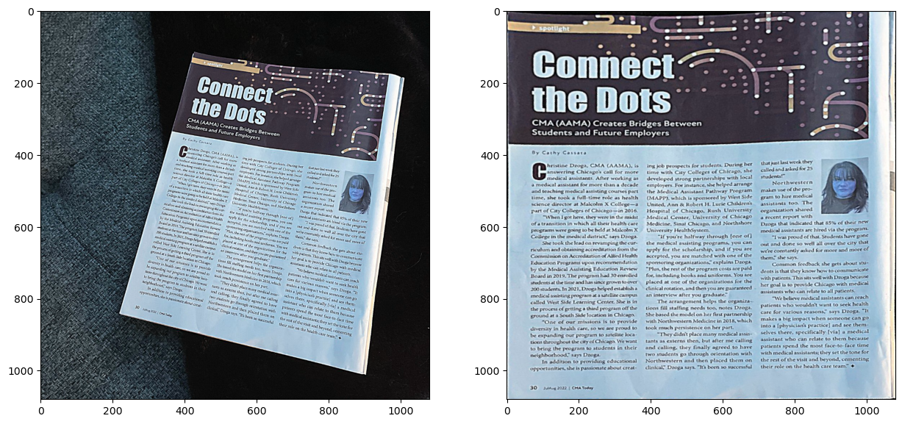

# computer-vision homework 7

Results using Affine transform:

1. Image with first 3 points (top_left, top_right, bottom_left)

    document.jpg
    

    test2.jpeg
    

2. Image with last 3 points (top_right, bottom_left, bottom_right)

    document.jpg
    

    test2.jpeg
    

3. Image with 3 points that received from estimateAffine2D using RANSAC to choose

    document.jpg
    

    test2.jpeg
    

Results using Homography:

1. Image using warpPerspective

    document.jpg
    

    test2.jpeg
    